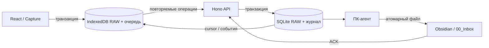

# Архитектура Vault Terminal 0.1

Слои связаны через общие типы в `packages/shared`. SQLite скрыт за `StorageAdapter`; при переносе на PostgreSQL реализация должна сохранить атомарность RAW+событие, проверки версий и таблицу квитанций. Наличие интерфейса не означает готовность PostgreSQL-реализации.

## Клиент

Dexie хранит notes, reminders, queue, settings и meta. Сохранение RAW и операции — единая транзакция, без сетевых вызовов внутри. Текст не trim/normalize при сохранении. Проверка пустой строки применяется отдельно. Локальный архив — метаданные, не изменение RAW.

Sync выполняется отдельно от React. Его используют окно и Service Worker. Web Locks сериализует обмены между вкладками и worker; там, где API недоступен, серверная идемпотентность защищает от повторов. IndexedDB-транзакции защищают сохранение локальных данных. Повторные триггеры: Save, online, focus, visibilitychange, периодическая проверка и ручная кнопка. Background Sync — дополнительная возможность, не основа надёжности.

Service Worker кеширует только сборку приложения, не приватные API-ответы. Новая версия ждёт закрытия старых вкладок и не перезагружает поле ввода с черновиком. Все данные доступны через IndexedDB и отдельный JSON-экспорт. Первая загрузка требует сети.

## Сервер

SQLite WAL, synchronous FULL, foreign keys и busy timeout. RAW-таблица защищена SQL-триггерами от изменения содержания и удаления; журнал событий защищён от update/delete. CRUD напоминаний использует версии и квитанции операций. Ошибка журнала откатывает основную запись. Логирование ошибок не включает текст заметок/напоминаний.

Это персональная база одного пользователя: авторизованные устройства имеют доступ к его заметкам. JWT, внешняя идентификация, многопользовательские аккаунты и E2EE не добавлены. Роли `client` и `desktop` ограничивают подтверждение записи в vault. Device-токен и session-токен хранятся на сервере только в виде SHA-256.

## Напоминания

Каждое изменение порождает уникальный operationId. Локальная optimistic version увеличивается в той же транзакции, что и добавление команды. Очередь отправляется последовательно для каждой сущности. Новая локальная правка во время запроса не перезаписывается старым ACK. При 409 локальная версия остаётся в БД и экспорте. Явное разрешение конфликта сохраняет команды и обе версии в recovery-запись, получает серверную версию и создаёт новую локальную копию.

В браузере проверка сроков работает в открытом окне каждые 10 секунд. В Android APK `AlarmManager` хранит разрешённое расписание отдельно от WebView, будит устройство, показывает вибрирующее heads-up/полноэкранное системное уведомление и обрабатывает Done/Snooze, даже когда приложение закрыто. Действия сохраняются в native storage до записи в IndexedDB и последующей синхронизации, поэтому краткое отсутствие сети не теряет изменение. Точное время требует явного системного доступа «Будильники и напоминания»; без него используется разрешённый Android fallback с возможной задержкой.

## ПК-агент

Путь к vault задаётся явно; агент не ищет хранилище самостоятельно. Он читает только серверный event log и собственные файлы в `00_Inbox`, `Conflicts`, `.vault-terminal`. Подпапки проверяются через lstat/realpath, symlink/junction запрещены. Проверка UUID предшествует созданию путей.

Публикация: эксклюзивный temp → write → fsync → close → hard link с невозможностью overwrite → удаление temp → ACK → отдельный immutable checkpoint. Если запись или ACK не удались, страница читается повторно. Существующая изменённая Markdown-версия остаётся на месте, точный RAW получает отдельный файл. После подтверждения агент не восстанавливает автоматически удалённый пользователем файл: оригинал остаётся на сервере и может быть выгружен повторным чтением журнала при восстановлении в **новый** vault.

## Следующие границы

AI-провайдер должен работать поверх файлового моста и не менять RAW. Нельзя предполагать undocumented API Chatting with AI. Перед этим этапом нужно проверить исходники плагина, реализовать последовательную очередь, ограниченный retry и восстановление processing после падения. Затем Reverse Ask, Capacitor, PostgreSQL и разрешённое зеркало vault с конфликтными копиями.

Проверенные первичные API: [Dexie transactions](https://dexie.org/docs/Dexie/Dexie.transaction()), [Node SQLite](https://nodejs.org/api/sqlite.html), [Background Sync](https://developer.mozilla.org/en-US/docs/Web/API/Background_Synchronization_API). По MDN Background Sync доступен не во всех браузерах; реализация сохраняет независимые foreground retry-триггеры.
